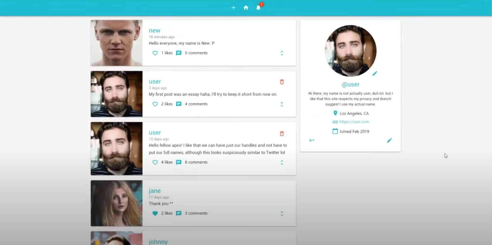
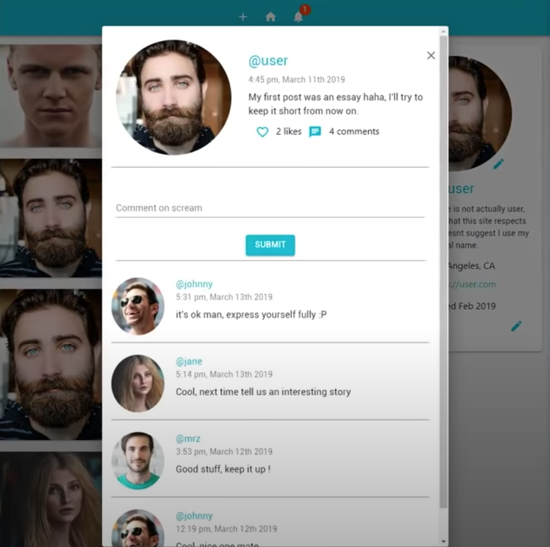
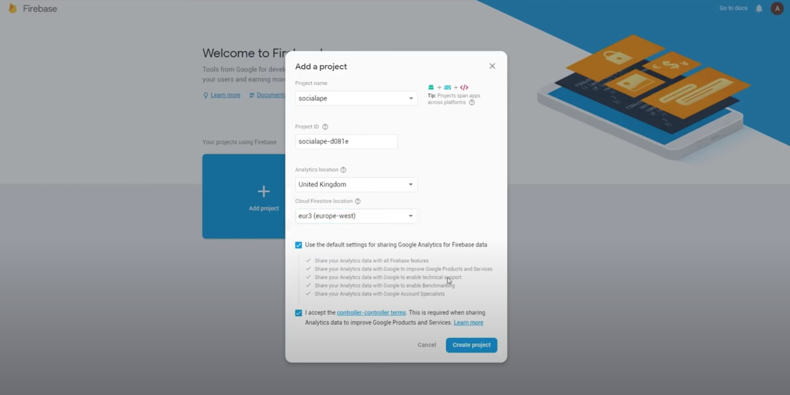

# FCCClasssed-ReactJSReduxFirebaseExpressJS-SocialMediaApp-20190624

> 🧩 freeCodeCamp (Classsed)  - Full Stack React & Firebase Tutorial - Build a social media app (Jun 24, 2019)

> Link: https://www.youtube.com/watch?v=m_u6P5k0vP0

***Code***

> 1. Functions code repo: https://github.com/hidjou/classsed-react-firebase-functions 
> 1. React code repo: https://github.com/hidjou/classsed-react-firebase-client
> 1. Email regular expression: https://pastebin.com/f33g85pd
> 1. NoImg: https://pixabay.com/vectors/blank-profile-picture-mystery-man-973460/
> 1. API Base URL: https://europe-west1-socialape-d081e.cloudfunctions.net/api


***Description*** 
> In this full tutorial course, you will learn how to create a full stack, fully-featured social media application using React, Firebase, Redux, Express, and Material-UI.

> This intermediate tutorial covers things such as creating a backend REST API server with Node.js and Express, user login and authentication, image uploads, notifications, cloud functions, deploying to Firebase, and much more.

> 🎥 Course created by Classsed. Check out their YouTube channel: https://www.youtube.com/classsed

---




## Course Contents
1. 0:00:00 - Introduction
2. 0:07:03 - Create & Read Data
3. 0:27:56 - Express & formatting response
4. 0:42:37 - User Registration
5. 1:03:22 - Validation & Login Route
6. 1:19:33 - Authentication Middleware
7. 1:33:10 - Refactoring & Organising
8. 1:48:46 - Image Upload
9. 2:13:45 - Add and Get User Profile Details
10. 2:33:15 - Getting and Commenting on Post
11. 2:56:38 - Like, Unlike and Delete Post
12. 3:25:42 - Create and Get Notifications
13. 3:58:11 - Finishing up Cloud Functions
14. 4:23:46 - Getting Started With React
15. 4:44:01 - Post Card Details
16. 5:11:45 - Login Form
17. 5:50:36 - Signup and Auth State
18. 6:05:16 - Redux Setup
19. 6:41:17 - Signup and Auth Route
20. 6:56:35 - Profile Section
21. 7:19:48 - Image Upload
22. 7:31:24 - Logout and Edit profile
23. 7:53:60 - Navbar Buttons
24. 8:07:60 - Like and Unlike Actions
25. 8:39:11 - Delete Button
26. 8:57:45 - Add Post Component
27. 9:20:19 - Post Dialog
28. 9:47:30 - Post Dialog Details
29. 10:01:21 - Displaying Comments
30. 10:16:29 - Submitting comments
31. 10:37:28 - User Page
32. 10:54:30 - Notifications
33. 11:31:59 - Loading Skeletons
34. 11:59:28 - Deployment to Firebase
---
## Table of Contents
- [FCCClasssed-ReactJSReduxFirebaseExpressJS-SocialMediaApp-20190624](#fccclasssed-reactjsreduxfirebaseexpressjs-socialmediaapp-20190624)
  - [Course Contents](#course-contents)
  - [34. 11:59:28 - Deployment to Firebase](#34-115928---deployment-to-firebase)
  - [Table of Contents](#table-of-contents)
- [0 - Introduction](#0---introduction)
  - [Prerequisites](#prerequisites)
- [703 - Create & Read Data](#703---create--read-data)
  - [836 - Create New Firebase Project](#836---create-new-firebase-project)
  - [2 - Functions](#2---functions)
  - [3 - 1330 Database](#3---1330-database)
    - [1 - New Collection: Screams](#1---new-collection-screams)
    - [2 - create the functions](#2---create-the-functions)
- [0:27:56 - Express & formatting response](#02756---express--formatting-response)
- [0:42:37 - User Registration](#04237---user-registration)
- [1:03:22 - Validation & Login Route](#10322---validation--login-route)
- [1:19:33 - Authentication Middleware](#11933---authentication-middleware)
- [1:33:10 - Refactoring & Organising](#13310---refactoring--organising)
- [1:48:46 - Image Upload](#14846---image-upload)
- [2:13:45 - Add and Get User Profile Details](#21345---add-and-get-user-profile-details)
- [2:33:15 - Getting and Commenting on Post](#23315---getting-and-commenting-on-post)
- [2:56:38 - Like, Unlike and Delete Post](#25638---like-unlike-and-delete-post)
- [3:25:42 - Create and Get Notifications](#32542---create-and-get-notifications)
- [3:58:11 - Finishing up Cloud Functions](#35811---finishing-up-cloud-functions)
- [4:23:46 - Getting Started With React](#42346---getting-started-with-react)
- [4:44:01 - Post Card Details](#44401---post-card-details)
- [5:11:45 - Login Form](#51145---login-form)
- [5:50:36 - Signup and Auth State](#55036---signup-and-auth-state)
- [6:05:16 - Redux Setup](#60516---redux-setup)
- [6:41:17 - Signup and Auth Route](#64117---signup-and-auth-route)
- [6:56:35 - Profile Section](#65635---profile-section)
- [7:19:48 - Image Upload](#71948---image-upload)
- [7:31:24 - Logout and Edit profile](#73124---logout-and-edit-profile)
- [7:53:60 - Navbar Buttons](#75360---navbar-buttons)
- [8:07:60 - Like and Unlike Actions](#80760---like-and-unlike-actions)
- [8:39:11 - Delete Button](#83911---delete-button)
- [8:57:45 - Add Post Component](#85745---add-post-component)
- [9:20:19 - Post Dialog](#92019---post-dialog)
- [9:47:30 - Post Dialog Details](#94730---post-dialog-details)
- [10:01:21 - Displaying Comments](#100121---displaying-comments)
- [10:16:29 - Submitting comments](#101629---submitting-comments)
- [10:37:28 - User Page](#103728---user-page)
- [10:54:30 - Notifications](#105430---notifications)
- [11:31:59 - Loading Skeletons](#113159---loading-skeletons)
- [11:59:28 - Deployment to Firebase](#115928---deployment-to-firebase)

---

# 0 - Introduction
## Prerequisites

1. NodeJs
2. VSCode
    1. Bracket Pair Colorizer by CoenraadS
    2. Prettier - Code Formatter by Esben Petersen
    3. ES7 React/Redux/GraphQL/React-Native Snippets by dszajder
3. Postman

# 703 - Create & Read Data

## 836 - Create New Firebase Project

@Firebase Console




Details: 

1. Project name: fccclassed-socialape-20190624
2. Analytics location: Select Region/Country
3. Cloud Firestore location: Select Region

Accept then create project

## 2 - Functions

1. Go inside project we just created and look for functions tab at sidebar of the project overview. 
2. Click Get Started to show install and deploy setup for functions

    ```jsx
    // Initiate Project
    // open new terminal
    npm i -g firebase-tools
    firebase login

    //Project Repo Setup
    mkdir FCCClasssed-ReactJSReduxFirebaseExpressJS-SocialMediaApp-20190624
    cd FCCClasssed-ReactJSReduxFirebaseExpressJS-SocialMediaApp-20190624

    //funcruibs setup
    mkdir socialape-functions
    cd socialape-functions

    //Inistiate Project
    firebase init
    - Proceed: Yes
    - Which Firebase CLI features you want to setup for this folder?
    - - Hit space only on functions then enter

    Select Project

    Javascript/Typescript: Javascript

    ESLint: no

    Install Dependencies with npm now: Yes

    //Deploy Functions
    firebase deploy 
    ```

3. try out a endpoint after firebase deploy using postman/thunder client from vs code

## 3 - 1330 Database

1. Go to database tab from the sidebar
2. get started with cloud firestore
3. then start in test mode

### 1 - New Collection: Screams


### 2 - create the functions

back to socialape-functions/functions/index.js

STOP → Functions now has charge, drop project :<

# 0:27:56 - Express & formatting response

# 0:42:37 - User Registration

# 1:03:22 - Validation & Login Route

# 1:19:33 - Authentication Middleware

# 1:33:10 - Refactoring & Organising

# 1:48:46 - Image Upload

# 2:13:45 - Add and Get User Profile Details

# 2:33:15 - Getting and Commenting on Post

# 2:56:38 - Like, Unlike and Delete Post

# 3:25:42 - Create and Get Notifications

# 3:58:11 - Finishing up Cloud Functions

# 4:23:46 - Getting Started With React

# 4:44:01 - Post Card Details

# 5:11:45 - Login Form

# 5:50:36 - Signup and Auth State

# 6:05:16 - Redux Setup

# 6:41:17 - Signup and Auth Route

# 6:56:35 - Profile Section

# 7:19:48 - Image Upload

# 7:31:24 - Logout and Edit profile

# 7:53:60 - Navbar Buttons

# 8:07:60 - Like and Unlike Actions

# 8:39:11 - Delete Button

# 8:57:45 - Add Post Component

# 9:20:19 - Post Dialog

# 9:47:30 - Post Dialog Details

# 10:01:21 - Displaying Comments

# 10:16:29 - Submitting comments

# 10:37:28 - User Page

# 10:54:30 - Notifications

# 11:31:59 - Loading Skeletons

# 11:59:28 - Deployment to Firebase